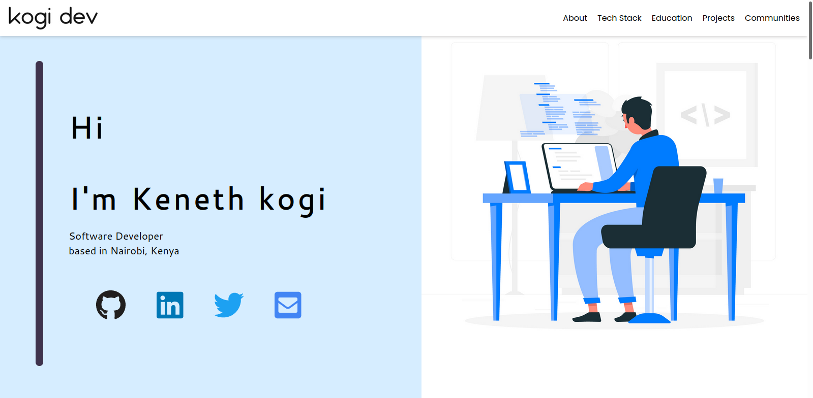
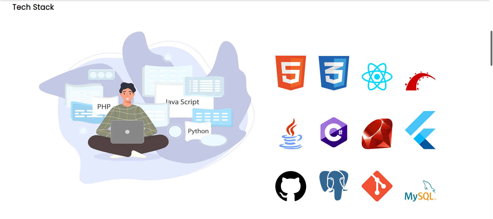

## Getting Started with Portfolio

Simple portfolio Website developed using ReactJS
Check it out <a href="https://kenny-kogi.github.io/portfolio/"><Here</a>

## Available Scripts

### `Run Project`

In the project directory, run yarn start after installing npm

## Screenshots

